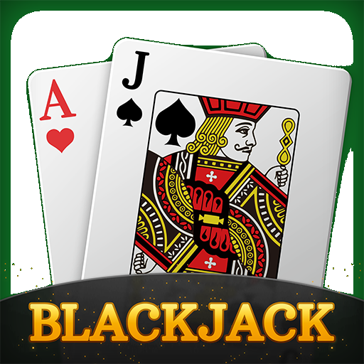

<h1>
  
  Blackjack Game
</h1>

## Introduction

This is a fully interactive console-based Blackjack game implemented in C#. The game simulates a standard Blackjack round between a dealer and a single player. The project is designed for educational and entertainment purposes, showcasing object-oriented programming principles such as encapsulation, inheritance, and state management.

The game features real-time card dealing, score calculation, hidden dealer cards, and a turn-based flow, giving users a clean, readable game experience inside the console.

---

## Features

- Turn-based Blackjack simulation
- Player and Dealer hands with proper score tracking
- Hidden dealer card revealed after player turn
- Console UI with card graphics and score output
- Win/loss tracking across multiple rounds

---

## How It Works

1. 🃏 The player and dealer are each dealt two cards at the start of the round.
2. 🎯 If neither party has 21 (Blackjack), the player begins their turn and can choose to Hit or Stand.
3. 🧠 After the player's turn, the dealer reveals their hidden card and follows standard rules (must hit if score is under 17).
4. 🏆 Once both turns conclude, the program compares scores and announces a winner.
5. 🔁 The win counter updates and the game can restart for another round.

---

## Technologies

- **C#** – The core programming language used
- **.NET Console Application** – For rendering game output
- **Object-Oriented Design** – Classes include `BlackjackHand`, `BlackjackDeck`, `Card`, `Game`, etc.

---

## Installation & Running

To run the game locally:

1. Clone the repository:
   ```bash
   git clone https://github.com/yourusername/blackjack-project.git
